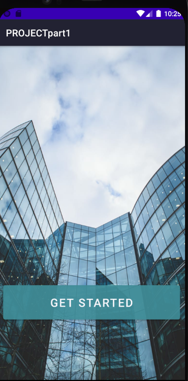
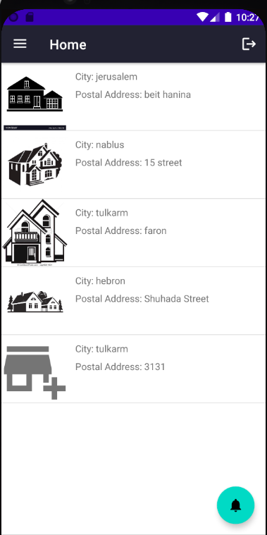
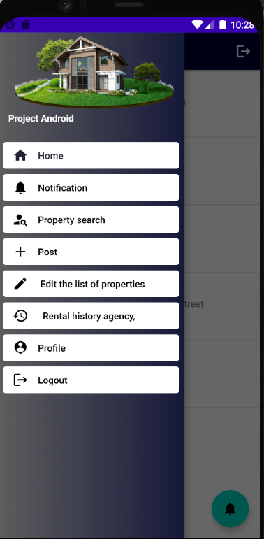
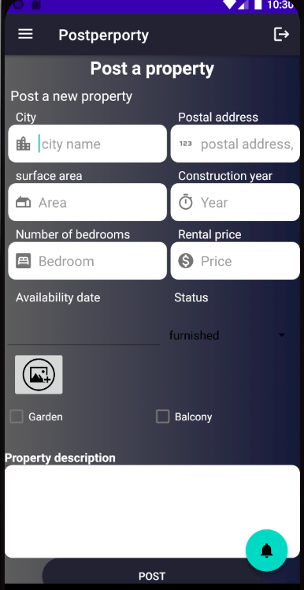
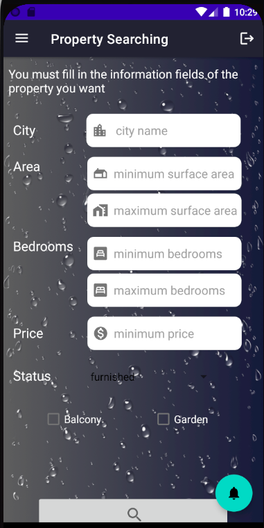
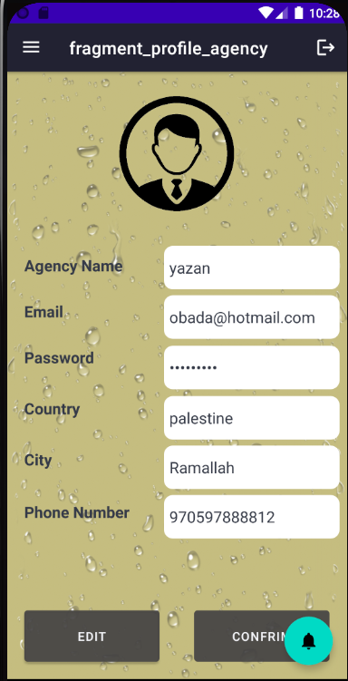

# Project-Android-House-Rentals

# Project Description:

 You are asked to develop a simple Android-based application that enables renting agencies to post 
houses for renting, and the tenants to search the available houses based on search criteria, and then apply to 
rent the houses they are interested in. Thus, the system has two types of users, namely, the renting agencies
and the tenants.
The application should include the following functionalities:

# 1.  Introduction layout
This layout has a “connect” button, which will connect to a server using REST and load the added properties
in an array-list.
a. If connection successful → go-to sing in and sign up page which contains the search icon at the bottom 
of the page.
b. If connection unsuccessful → show an error message and stay on the same layout.
The tenant can search and browse the houses as a guest and as a registered user. The guest can view only, but 
the registered user can view and apply for a house rental. If the guest user tries to apply for a house rental, 
then the App redirects him or her to the sign-up/sign-in page

# 2.  Signup, Sign in, and Logout
This layout should have a “Sign in” and “Sign Up” buttons.
a. (10 points) In the main page (first page), the user can enter his or her e-mail and password that are 
registered in the database to sign in into a special menu depending on the user type, i.e., a renting 
agency or a tenant. This layout must have a check box called “remember me” which will save the 
email in shared preferences, so next time the user logins, he or she does not need to re-type the 
email address. 
b. (20 points)The Sign-Up button redirects the user to another layout, where he or she determines the 
user type by clicking one of the following two buttons. Then, a sign up form is displayed according 
to the user type

Tenant Signup Form: it has the following required fields
1) Email address. Must be in a correct email format. It is the primary key of the user.
2) First name. Minimum 3 characters and maximum 20 characters.
3) Last name. Minimum 3 characters and maximum 20 characters.
4) Gender (spinner)
5) Password. Minimum 8 characters and maximum 15 characters. It must contain at least one number, 
one lowercase letter, one uppercase letter, and at least one special character from this character set
only: $, %, #, @, !, {, and }.
6) Confirm password. The password must be encrypted using a secure Hash Function.
7) Nationality (spinner with not less than 6 nationalities).
8) Gross Monthly Salary (must be a number).
9) Occupation. Maximum 20 characters.
10)Family Size (must be a number)
11)Current residence country (spinner with not less than 6 countries).
12)City. Minimum two cities per country.
13)Phone number. It must have pre zip code (area code), e.g., Palestine (00970), Jordan (00962), Syria
(00963) …etc. This must be changeable according to the country and NOT by the user.

Renting Agency Signup Form: it has the following required fields
1) Email address. Must be in a correct email format. It is the primary key of the user.
2) Agency Name. Maximum 20 characters.
3) Password. Minimum 8 characters and maximum 15 characters. It must contain at least one number, 
one lowercase letter, one uppercase letter, and at least one special character from this character set
only: $, %, #, @, !, {, and }.
4) Confirm password. The password must be encrypted using a secure Hash Function.
5) Country (spinner with not less than 6 countries).
6) City. Minimum two cities per country.
7) Phone number. It must have pre zip code (area code), e.g., Palestine (00970), Jordan (00962), Syria
(00963) …etc. This must be changeable according to the country and NOT by the user.

If all required fields in each sign up form are filled with valid data, then and only then the user can be
registered. Otherwise, an error message is displayed, and the missing or invalid fields are colored in red.

# 3.  Home layout (sign in as normal user) 

This layout should be a Navigation Drawer Activity which will contain the most up-to-five recent 
properties posted. The navigation bar should have the following functionality:

a. (10 points) Home: displays the most up-to-five recent properties posted (main page).

b. (15 points) Property search: which allows the tenant to search for a certain property using the following 
search criteria and wishes: city, minimum surface area, maximum surface area, minimum number of 
bedrooms, maximum number of bedrooms, minimum number of rental price, status (furnished and 
unfurnished), has a balcony (checkbox), has a garden (checkbox). In other words, the user fills the 
property search form with the fields mentioned above.

c. (10 points) Post a property, which allows the renting agency to post a new property with the following 
information: city, postal address, surface area, construction year, number of bedrooms, rental price, 
status, furnished or unfurnished, photos, availability date, and the property description (up 20 200 
words). Each post will be valid until the property is rented. If it is not rented within 90 days, the post 
disappears automatically.

d. (10 points) Edit the list of properties: the renting agency should be able to view its list of posted 
properties. Each item in the list has a view button to view the property details. After the property 
information is displayed, there are two buttons, namely, edit and delete at the bottom to allow the user 
to edit or to delete this property.

e. (5 points) Rental history of the tenant, which lists all properties that the tenant has rented through this 
application. In this list, it shows the city and the postal address of the property, the renting period, and 
the renting agency name.

f. (5 points) Rental history of the renting agency, which lists all properties that renting agency has rented 
through this application. In this list, it shows the city and the postal address of the property, the renting 
period, and the tenant first and last names.

g. (15 point) Rental Application Menu:
This menu allows the tenant to search for a certain property based on the search criteria mentioned above
(in b). The search results are listed with a “view” button besides each result. Once the user clicks the “view”
button, all details of the property are displayed with an “Apply” button at the bottom. When the “Apply”
button is clicked, then a notification is sent to the renting agency of this property. The renting agency can 
see the list of rental applications, with a “View Tenant” button. Clicking the later button allows the renting 
agency to view the tenant profile and his or her renting history to decide about the renting application. For 
each rental application, the renting agency can click either an “Approve” or a “Reject” button as a response 
to this application. After that, the tenant will receive a notification. The decision on the renting application 
is reflected on the database.

h. (5 points) Profile, which allows both types of users (the tenants and the renting agencies) to view and 
edit their profiles.

i. (5 points) Logout: which allows both types of users (the tenants and the renting agencies) to log out
from the system and redirected to the sign in page.

# 

    

 

    

    

  

